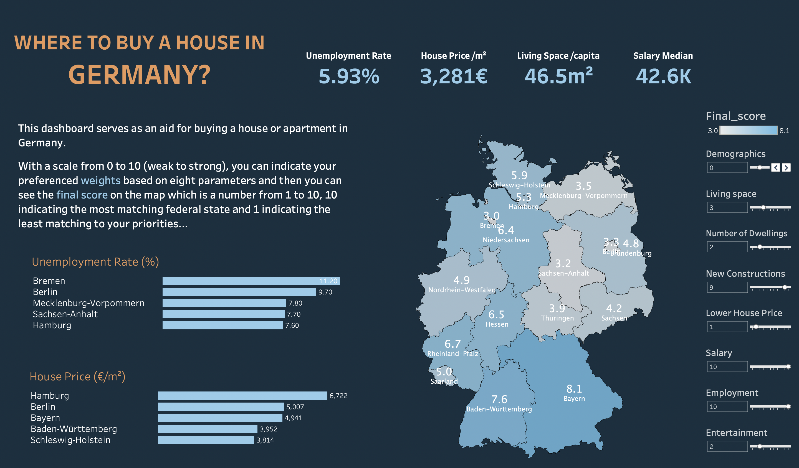

# Real-Estate-Demographics

Welcome to our capstone project! Click on the photo to try it:

[](https://public.tableau.com/app/profile/farnaz.irani/viz/HouseBuyerGuide/Dashboard)


## Overview

Analysis of factors influencing a possible investment decision in a real estate purchase. Our question was in which region of Germany the supply of residential real estate will increase. In addition, we extended the analysis to include entertainment and income.
Starting point was the analysis of the demographic development in all federal states as well as different factors of influence in the real estate sector (e.g. number of apartments, prices) on the possible supply of residential real estate.
The basis of the analysis is the data provided by the Federal Statistical Office for the area of population and housing, from 2000 to 2050. In addition, data from individual providers (e.g. Tripadvisor) are included.
The main output are various evaluations of the individual anaylsed influencing factors in the corresponding regions. A data model, which weights the individual factors according to interest, calculates the corresponding location.

## Install

To use the score calculator, first install the Python packages using PIP:

```bash
pip install -r requirements.txt
```

## Usage

With a scale from 0 to 10 (weak to strong), you can indicate your preferenced weights based on eight parameters and then you can see the final score which is a number from 1 to 10, 10 indicating the most matching federal state and 1 indicating the least matching to your priorities.

There are two score calculator functions in `score_calculator.py`:
- `calc_avg_score`
- `calc_score`

The former gets a dictionary of eight categories and their weights influencing the decision to buy a house, e.g.:

```python
calc_avg_score({
  'scaled_employment_rate': 10,
  'scaled_house_price_€/m²': 2,
  'scaled_salary': 10,
  'demographics': -10,
  'entertainment': 10,
  'new_building': 7,
  'scaled_living_space_1000qm': 2,
  'scaled_apartment': 0})
```

The latter works the same, but gets a more detailed set of factors and their weights:

```python
calc_score({
  'age_avg': 2, 'new_building': 2,
  'area_new_b': 2, 'rooms_new_b': 2,
  'cinema_seat': 1, 'salary': 3,
  'museum': 1, 'apartment': 2,
  'restaurant': 1, 'employment_rate': 3,
  'living_space_1000qm': 3,
  'pop_diff': 1, 'house_price_€/m²': 3, 'babyboomer_percentage': 2})
```

## Sources and Tools

* [Kanban-Board](https://miro.com/app/board/uXjVOzj4vXk=/?userEmail=deming.cheung@outlook.com&track=true&utm_source=notification&utm_medium=email&utm_campaign=add-to-team-and-board&utm_content=go-to-board&invite_link_id=824995705973)  
* [MVP](https://miro.com/app/board/uXjVOzOpuN4=/)  
* [Data Sources](https://docs.google.com/spreadsheets/d/1CCJFOJi3ZScCt8BZwK8xA_fqC1bCAsB3bcCP4lncxOA/edit#gid=0)  
* [Stakeholder Presentation](https://docs.google.com/presentation/d/1kREDLAWqnXOzMYnnlQCyfycUMn3G9qslpF6I2G-3iX8/edit#slide=id.g12ced5afda5_0_0)
* [genesis](https://www-genesis.destatis.de/genesis/online?operation=previous&levelindex=0&step=0&titel=&levelid=1652949290654&acceptscookies=false)
  * [API Documentation](https://www-genesis.destatis.de/genesis/misc/GENESIS-Webservices_Einfuehrung.pdf)  
* Regionaldatenbank
  * [Database](https://www.regionalstatistik.de/genesis/online/) 
  * [API Documentation](https://www.regionalstatistik.de/genesis/misc/Deep-Links_REG.pdf) 
